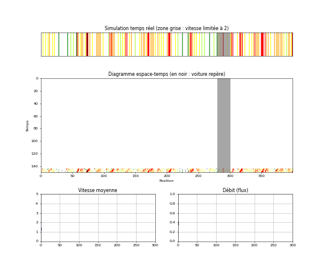
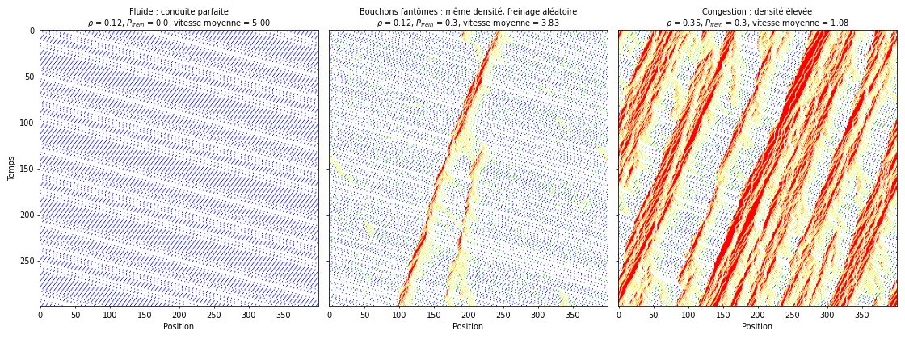
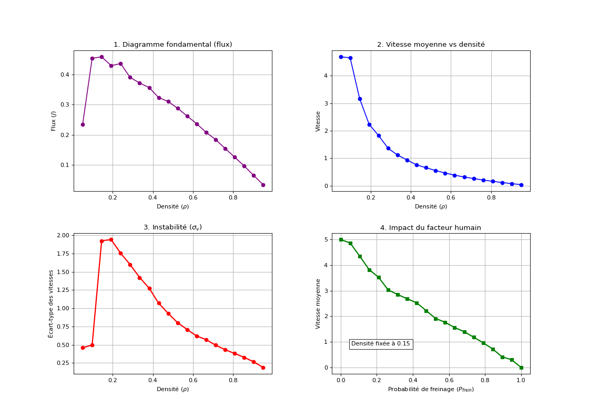

# Trafic routier : modèle de Nagel-Schreckenberg

Simulation d'un trafic autoroutier par **automate cellulaire stochastique**, vectorisée avec NumPy. À partir de quatre règles de conduite locales, on voit apparaître des **bouchons fantômes** (sans accident ni obstacle) et une **transition de phase** entre trafic fluide et trafic congestionné.



*En haut : la route à l'instant présent (couleur = vitesse, du rouge à l'arrêt au bleu à pleine vitesse). Au milieu : diagramme espace-temps, le temps s'écoule vers le bas ; la voiture repère est en noir et la zone grise est une zone de travaux limitée à la vitesse 2. En bas : vitesse moyenne et débit au cours du temps. L'animation part de voitures placées au hasard : on voit le diagramme se remplir et les bouchons se former, puis le régime établi (450 pas de temps).*

> **En bref**
> - Chaque voiture suit quatre règles simples : accélérer, ne pas percuter, freiner parfois au hasard, avancer.
> - Le hasard seul suffit à créer des bouchons qui remontent le trafic : à densité égale, la vitesse moyenne passe de 5 à 3,8 dès qu'on ajoute le freinage aléatoire.
> - Le débit maximal (≈ 0,46 voiture par pas de temps) est atteint vers $\rho \approx 0{,}14$ : au-delà, ajouter des voitures diminue le débit.
> - Toutes les voitures sont mises à jour en une seule opération NumPy, sans boucle sur les véhicules.

## Sommaire

1. [Objectif](#1-objectif)
2. [Le modèle](#2-le-modèle)
3. [Grandeurs macroscopiques et attendus théoriques](#3-grandeurs-macroscopiques-et-attendus-théoriques)
4. [Implémentation](#4-implémentation)
5. [Résultats et analyse](#5-résultats-et-analyse)
6. [Limites et pistes](#6-limites-et-pistes)
7. [Lancer le code](#7-lancer-le-code)
8. [Références](#8-références)

---

## 1. Objectif

Comprendre comment des règles de conduite **locales et simples** font émerger des phénomènes **collectifs** : bouchons spontanés, ondes de congestion qui remontent la route, effondrement du débit au-delà d'une densité critique. Contrairement aux modèles hydrodynamiques qui traitent le trafic comme un fluide continu, on adopte une approche microscopique où chaque véhicule est une entité discrète.

## 2. Le modèle

### Discrétisation

- **Espace** : la route est une suite de $L = 400$ cellules. Chaque cellule mesure environ 7,5 m (longueur d'une voiture plus la distance de sécurité à l'arrêt) et contient au plus une voiture. La route fait donc 3 km.
- **Temps** : pas de temps discrets, d'environ 1 s.
- **Vitesse** : entière, $v \in \lbrace 0, 1, \dots, v_{max}\rbrace$ en cellules par pas de temps. Avec $v_{max} = 5$, la vitesse maximale vaut 37,5 m/s, soit 135 km/h.

### Les quatre règles

À chaque pas de temps, toutes les voitures appliquent **simultanément** (mise à jour parallèle) les règles suivantes. On note $x_n$ et $v_n$ la position et la vitesse de la voiture $n$, et $d_n$ le nombre de cellules vides devant elle.

1. **Accélération** (désir de rouler vite) : $v_n \leftarrow \min(v_n + 1,\ v_{max})$
2. **Sécurité** (ne pas percuter la voiture de devant) : $v_n \leftarrow \min(v_n,\ d_n)$
3. **Freinage aléatoire** (facteur humain) : avec la probabilité $p$, $v_n \leftarrow \max(v_n - 1,\ 0)$
4. **Déplacement** : $x_n \leftarrow x_n + v_n$

La règle 3 est l'ingrédient clé : sans elle, le modèle est déterministe et ne produit pas de bouchons spontanés à faible densité. Elle représente l'hésitation, les distractions, les réactions excessives au freinage d'un autre conducteur.

### Conditions aux limites périodiques

La route est refermée en anneau : la cellule 399 est suivie de la cellule 0. Positions et distances sont calculées modulo $L$ :

$$d_n = (x_{n+1} - x_n - 1) \bmod L$$

On évite ainsi de gérer des entrées et sorties de véhicules : le nombre de voitures $N$, et donc la densité $\rho = N/L$, reste constant pendant toute la simulation.

### Scénario de travaux

Une zone entre les cellules 280 et 300 limite la vitesse à $v_{travaux} = 2$. Elle joue le rôle de goulot d'étranglement (utilisée dans l'animation, désactivée pour les études statistiques).

## 3. Grandeurs macroscopiques et attendus théoriques

| Grandeur | Définition |
|---|---|
| Densité | $\rho = N / L$ (fraction de cellules occupées) |
| Vitesse moyenne | $\langle v \rangle = \frac{1}{N}\sum_n v_n$ |
| Débit (flux) | $J = \rho\thinspace\langle v \rangle$ : nombre de voitures passant en un point par pas de temps |
| Instabilité | $\sigma_v$ : écart-type des vitesses |

La relation $J(\rho)$ s'appelle le **diagramme fondamental** du trafic.

**Cas déterministe ($p = 0$).** En régime établi, le débit vaut $J = \min(\rho\thinspace  v_{max},\ 1 - \rho)$ :

- phase **fluide** pour $\rho < \rho_c = 1/(v_{max} + 1) = 1/6 \approx 0{,}167$ : toutes les voitures roulent à $v_{max}$ et $J = v_{max}\thinspace\rho$ ;
- phase **congestionnée** au-delà : le débit décroît linéairement.

**Cas stochastique ($p > 0$).** En phase fluide, chaque voiture perd en moyenne $p$ par pas, d'où $\langle v \rangle \approx v_{max} - p$ et $J \approx (v_{max} - p)\thinspace\rho$. Le débit maximal est plus faible et atteint à une densité plus basse que dans le cas déterministe, et des bouchons se forment spontanément près de la densité critique, avec de fortes fluctuations de vitesse.

## 4. Implémentation

### Représentation de la route

La route est un tableau NumPy de $L$ entiers : $-1$ pour une cellule vide, sinon la vitesse de la voiture qui l'occupe. Positions et vitesses se lisent directement dans ce tableau.

### Vectorisation

Au lieu de boucler sur les voitures, chaque règle s'applique à tout le tableau d'un coup :

| Étape | Opération NumPy |
|---|---|
| Trouver les voitures | `pos = np.where(route > -1)[0]`, puis `v = route[pos]` |
| Voiture suivante | `np.roll(pos, -1)` décale le tableau des positions : la voiture $i$ « voit » la voiture $i+1$ |
| Distance libre | `(np.roll(pos, -1) - pos) % L - 1` : le modulo gère la route circulaire |
| Accélération, sécurité | `np.minimum(v + 1, V_MAX)`, puis `np.minimum(v, distance)` |
| Zone de travaux | masque booléen `(pos >= 280) & (pos <= 300)` |
| Freinage aléatoire | tirage `np.random.rand(len(v)) < P_FREIN` sur toutes les voitures à la fois |
| Déplacement | `(pos + v) % L`, puis écriture dans une nouvelle route vide |

### Structure du programme

| Phase | Contenu |
|---|---|
| **Phase 1 : observation** | animation en temps réel (`next_step`) : route, diagramme espace-temps, vitesse moyenne et débit ; une voiture « repère » est suivie en noir |
| **Phase 2 : statistiques** | `calcul_stat` fait tourner la simulation sans affichage : 300 pas, les 150 premiers servent de mise en régime (warm-up), les mesures sont moyennées sur les 150 suivants ; balayage de 20 densités, puis de 20 probabilités de freinage |
| **Phase 3 : comparaison** | trois diagrammes espace-temps côte à côte, sans travaux : fluide, bouchons fantômes, congestion |

### Paramètres

| Paramètre | Valeur | Rôle |
|---|---|---|
| `L` | 400 | longueur de la route (cellules) |
| `DENSITE` | 0,3 | densité de l'animation |
| `V_MAX` | 5 | vitesse maximale |
| `P_FREIN` | 0,3 | probabilité de freinage aléatoire |
| `DT` | 150 | nombre de pas affichés dans le diagramme espace-temps |
| `DEBUT_TRAVAUX`, `FIN_TRAVAUX`, `V_TRAVAUX` | 280, 300, 2 | zone de vitesse limitée |

## 5. Résultats et analyse

### Lire un diagramme espace-temps

Chaque ligne est une photo de la route à un instant, le temps s'écoulant vers le bas. Une voiture qui avance trace une ligne oblique vers la droite ; une voiture arrêtée trace une ligne verticale rouge.

Sur l'animation, les **trajectoires des voitures** (fines lignes bleues) descendent vers la droite, mais les **zones de congestion** (bandes rouges) descendent vers la gauche : les bouchons **remontent le trafic**. Une voiture entre dans un bouchon par l'arrière et en sort par l'avant, pendant que le bouchon recule. Ce sont des ondes de choc rétrogrades, bien connues sur autoroute.

### Trois régimes comparés



- **À gauche**, $\rho = 0{,}12$ sans freinage aléatoire : toutes les voitures roulent à la vitesse maximale, aucun bouchon ne se forme. On est sous la densité critique déterministe $1/6$.
- **Au centre**, même densité avec $P_{frein} = 0{,}3$ : des bouchons naissent spontanément, sans obstacle ni accident, remontent le trafic puis se résorbent. La vitesse moyenne tombe de 5 à 3,8. Ce sont les **bouchons fantômes** : une fluctuation de vitesse d'un conducteur s'amplifie chez ceux qui le suivent.
- **À droite**, $\rho = 0{,}35$ : au-delà de la densité critique, les bouchons deviennent permanents et la vitesse moyenne tombe à environ 1.

### Statistiques



**1. Diagramme fondamental.** La courbe $J(\rho)$ a la forme en arche attendue :

- à faible densité, $J$ croît linéairement avec une pente d'environ 4,7, conforme à la prédiction $v_{max} - p = 4{,}7$ ;
- le débit maximal, $J \approx 0{,}46$, est atteint vers $\rho \approx 0{,}14$ (le balayage a un pas de 0,05). C'est nettement moins que le maximum déterministe $5/6 \approx 0{,}83$ à $\rho = 1/6$ : le freinage aléatoire coûte près de la moitié de la capacité de la route ;
- au-delà, la branche est décroissante : chaque voiture ajoutée réduit le débit total. À $\rho = 0{,}3$ (densité de l'animation), le système est en régime congestionné.

**2. Vitesse moyenne.** Elle reste proche de $v_{max} - p$ en phase fluide, puis s'effondre après la densité critique.

**3. Instabilité.** L'écart-type des vitesses présente un pic marqué juste après la densité critique : c'est là que le système hésite entre les deux phases, avec des voitures à pleine vitesse et d'autres à l'arrêt. C'est la zone où le trafic est le moins prévisible.

**4. Facteur humain.** À densité fixée ($\rho = 0{,}15$), la vitesse moyenne décroît presque linéairement avec la probabilité de freinage. Passer d'une conduite parfaite ($p = 0$, vitesse 5) à une conduite réaliste ($p = 0{,}3$) fait perdre environ 40 % de la vitesse moyenne (de 5 à environ 3). À $p = 1$, le freinage annule l'accélération à chaque pas : une voiture arrêtée ne redémarre jamais, les autres finissent par la rattraper et le trafic se bloque totalement.

### Zone de travaux

Dans l'animation, la zone de travaux agit comme un goulot d'étranglement : les voitures arrivant à vitesse élevée doivent freiner brutalement pour y entrer, ce qui crée une zone dense persistante **en amont**. **En aval**, le flux ressort fluide, car la zone limite le débit sortant.

## 6. Limites et pistes

- **Une seule voie**, sans dépassement ni changement de file. Les modèles à plusieurs voies ajoutent des règles de changement de voie.
- **Résolution du diagramme fondamental** : un seul tirage par densité et un pas de 0,05. Moyenner sur plusieurs graines aléatoires et affiner le balayage autour du maximum donnerait une estimation plus précise de la densité critique, avec barres d'erreur.
- **Métastabilité** : le modèle de base ne reproduit pas l'hystérésis observée sur autoroute (un trafic dense qui reste fluide jusqu'à une perturbation). Des variantes comme la règle « slow-to-start » (redémarrage retardé) la font apparaître.
- **Bords ouverts** : injecter et retirer des voitures aux extrémités permettrait d'étudier une bretelle d'accès ou une route réelle.
- **Calibration** : comparer à des données réelles de boucles de comptage.

## 7. Lancer le code

```bash
pip install -r requirements.txt
python trafic.py             # animation, puis statistiques et comparaison à la fermeture de la fenêtre
python trafic.py --sauver    # enregistre le GIF et les figures dans figures/
```

Les paramètres sont regroupés en haut du fichier.

## 8. Références

- K. Nagel et M. Schreckenberg, *A cellular automaton model for freeway traffic*, Journal de Physique I 2, 2221 (1992).
- D. Chowdhury, L. Santen et A. Schadschneider, *Statistical physics of vehicular traffic and some related systems*, Physics Reports 329, 199 (2000).
- M. Treiber et A. Kesting, *Traffic Flow Dynamics*, Springer (2013).

---

Projet réalisé en M1 Physique à CY Cergy Paris Université (cours « Méthodes numériques pour les matériaux », février 2026).
